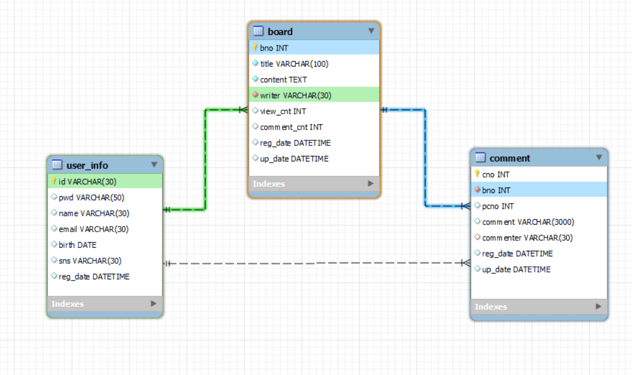
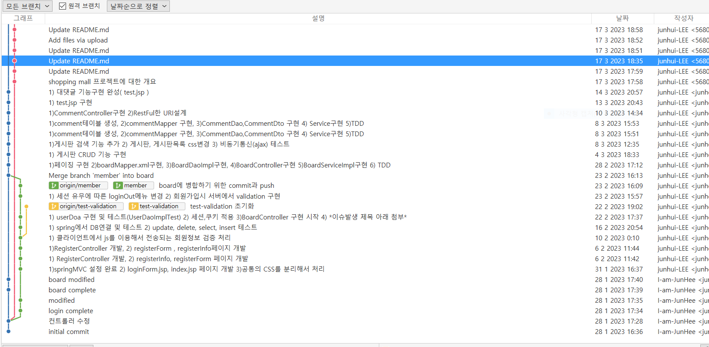
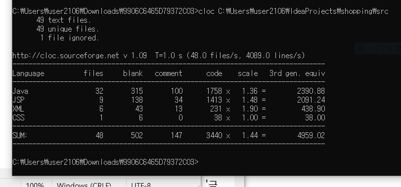

# shopping mall 프로젝트 

## :point_right: 프로젝트 소개 
> 중고나라 카페를 모티브로 한 중고거래 shopping mall 프로젝트
>
> 😄 http://15.164.217.1:8080/shopping/

## :point_right: 주요기능

### 1. 회원시스템

* 유효성검사 : 
	* 사용자가 회원가입시 id, pwd를 정해진 규칙으로 보내지 않으면 서버에서 에러메시지 출력 
* 세션, 쿠키 : 
	* 로그인 성공시 세션ID=계정아이디로 쿠키에 담겨 상태정보가 유지된다.
	* 아이디기억 체크박스 클릭시 이전에 입력했던 아이디가 기억된다. 
	* 로그인 실패시 js에서 에러메시지 출력
	* 로그인 되지 않은 상태에서 Board메뉴 클릭시 로그인폼 출력, 이후 게시판 메뉴로 바로 이동한다. 구현방법은 로그인페이지에 속성을 hidden으로 하는 `<input>`태그를 만들고 그곳에 게시판 정보를 주고 url에 toURL 파라미터를 붙여서 컨트롤러에서 처리 
* DB접근 : 
	* JDBC 사용 , DAO작성 

### 2. 게시판

* 페이징 처리 : 
	* 만일 게시물이 많을 경우에 10개씩 그룹화 해서 보여지게끔 구현(페이징 처리)
	* 사실상 보여지는 웹페이지는(boardList.jsp)한개인데 사용자가 페이지를 누름에 따라서 UI와 boardList.jsp 안의 내용이 바뀌어야 함 이를 처리하기 위해서 pageHandler.java 객체를 생성 및 활용하고 jstl 태그 라이브러리를 이용해서 구현했습니다.   쿼리는 `SELECT * FROM board ORDER BY reg_date DESC, bno DESC LIMIT  #{offset}, #{pageSize}`을 사용했습니다.
* CRUD(게시판 읽기, 쓰기, 삭제, 수정) : 
	* BoardController.java에 read(), write(), remove(), modify()메서드 구현 
	* 게시판의 작성자를 구분짓기 위해서 HttpSession 인자 활용 
	* 기능 실패시 컨트롤러에서 예외처리 및 게시판 화면(board.jsp)에 경고창 출력 
	* 게시판 쓰기와 게시판 수정을 같은 화면(board.jsp)를 쓰기 때문에 구분짓기 위해서 쓸때에는 "mode"-"new"를 board.jsp에 넘겨준다. 
	* 게시물의 작성자와 계정의 세션ID(로그인 아이디)가 일치할 때 게시물수정, 게시물삭제 가능
* 검색 기능 :
	* boardMapper.xml에 `<choose>`태그와 `LIKE concat('%', #{keyword}, '%')`을 활용해서  검색옵션(제목, 제목+내용, 작성자)에 따라서 다른 SQL문이 적용되도록 구현 
	* 검색 후 들어왔던 페이지로 이동하기 위해서 SearchCondition.java 객체 생성 및 활용 
* DB접근 : MyBatis, DAO, DTO

### 댓글, 답글(대댓글) :

* 사용자가 Board메뉴를 누른후 임의의 게시물제목을 누르면 댓글과 답글을 작성할 수 있습니다. 
* 트랜잭션 처리 : 
	* 사용자가 댓글 및 답글을 달 경우 comment테이블에 CommentDto추가하는 쿼리랑 board테이블에 comment_cnt를 갱신하는 쿼리를 하나로 묶어서 처리 [코드보기](https://github.com/junhui-LEE/shopping/blob/main/src/main/java/org/example/service/CommentServiceImpl.java)
* 댓글 입력폼이나 답글 입력폼에서 댓글 및 답글의 CRUD를 하면 ajax를 통해서 비동기로 각각의 매핑되는 서버(메서드)와 통신합니다. 
* 사용자는 정렬된 댓글과 답글을 봐야 하기 때문에 쿼리는  
`SELECT cno, bno, ifnull(pcno, cno) as pcno, comment, commenter, reg_date, up_date 
FROM comment
WHERE bno = 1921
ORDER BY pcno ASC, cno ASC;`   을 사용했습니다. 
* DB접근 : Mybatis, DAO, DTO

## :point_right: 프로젝트 주요 관심사 (진행중)
### 단순 기능 구현에만 집중하지 않기 
* 단순히 기능을 빠르게 구현하는것보다 중요한 것은 `사용 기술을 정확하게 이해` 하고 사용하는 것이라고 생각합니다. 
* 새로운 기술을 적용할 때 `기술서적과 공식문서를 통해 해당 기술에 대한 깊이 있는 학습` 을 진행하여 이를 최대한 코드에 녹이기 위해 노력했습니다. 
### 테스트 코드 작성에 충실하기 
* 올바른 기능 구현과 `예상한대로 코드가 동작하는지 검증` 하기 위해 `새로운 기능을 구현할 때 마다 통합테스트 및 단위테스트를 구현` 하도록 하였습니다. 
* 새로운 개발자가 합류했을 경우 기능을 추가하거나 수정할 때 테스트 코드를 통해 문제가 없음을 보장하고 자신감을 줌으로서 빠르게 프로젝트에 적응할 수 있습니다. 
* 또한 테스트 코드는 작성된 코드에 대한 `문서` 자체의 역할을 하기도 합니다. 
### 이력을 남기자 
* 협업을 통해 프로젝트의 규모가 커지면 진행현황과 개발흐름, 비용측정에 있어서 이력관리는 필수라고 생각합니다. 따라서 git을 통해서 해당 프로젝트의 이력을 관리했으며 git-flow전략은 [우아한형제들 기술블로그](https://techblog.woowahan.com/2553/)을 참고 했습니다. 
### 문서화
새로운 개발자가 중간에 프로젝트에 참여하더라도 [Wiki](https://github.com/junhui-LEE/shopping/wiki)와 같은 문서를 통해  프로젝트에 대해 쉽게 이해하고 적응할 수 있도록 하였습니다. 

## :point_right: ERD

## :point_right: git-flow
 

## :point_right: 프로젝트 규모( Line Of Code )

## :point_right: 기술 스택
### 💻 Front-End
   

### 💻 Back-End
  
     

### 💻 Dev tools
      

